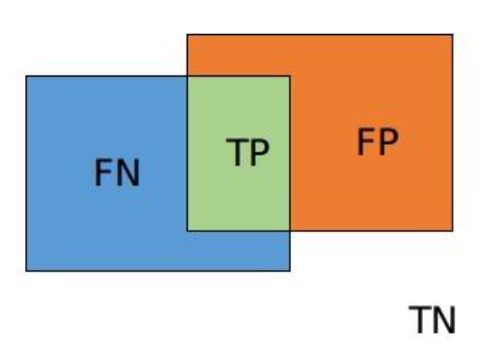

# Dice Loss

## 0. 问题背景

我最近在做计算机视觉中边缘检测任务，在选择损失函数的时候犯了难。边缘检测有两个很重要的特征，一是正样本数量远低于负样本（面临样本不平衡问题），第二是边缘的标签往往是线，转换为张量后往往会人为给定一个宽度（例如一个像素），那么有没有loss除了能衡量是不是边缘还能衡量边缘靠近与否呢？我看到了一些博客说的dice loss，记录一下学习过程。

## 1. 什么是Dice Loss?

Dice Loss是受[Dice系数](https://zh.wikipedia.org/wiki/Dice系数)启发得到的一个损失函数，主要用于衡量语义分割任务中真实标签和预测结果之间相似性。比较深入的探讨可以看看[语义分割之dice loss](https://zhuanlan.zhihu.com/p/269592183)。

## 2. 原始的Dice系数（离散版本）

对于两个集合而言，原始的Dice系数是计算

Dice 系数的原始定义如下：
$$
\text{Dice} = \frac{2 |A \cap B|}{|A| + |B|}
$$
用图像表示如下：

$$
\text{Dice} = \frac{2TP}{2TP + FP + FN}
$$

这个公式**与 [F1 Score](./F1_score.md) 在二分类问题下完全等价**：
$$
\text{F1} = \frac{2 \times \text{Precision} \times \text{Recall}}{\text{Precision} + \text{Recall}}= \frac{2TP}{2TP + FP + FN}
$$

## 3. 为什么原始 Dice 公式不可导？

因为它涉及的是**集合操作（计数，cardinality）**：

- **交集** ∣A∩B∣需要通过**离散的数值比较**。
- **并集** ∣A∣+∣B∣也是**离散计数**。

这些计算**是非连续的、不可微的**，不能用于反向传播（Back-propagation）来计算梯度，因此**不能直接优化**。这也是F1 score 为什么用于评估指标(Metric)而不是直接用于损失函数的原因。

------

## 4. 让 Dice Loss 可导：概率化

为了让 Dice Loss 可导，将**离散的二值集合运算替换为概率计算**，而实现方式也有好几种：

1. 方式一：
   $$
   L_{Dice}=1-\frac{2 \sum P_i G_i+\epsilon}{\sum P_i+\sum G_i+\epsilon}
   $$

2. 方式二：

$$
L_{Dice}=1-\frac{ \sum P_i G_i+\epsilon}{\sum P_i+\sum G_i-\sum P_i G_i+\epsilon}
$$

3. 方式三：

$$
L_{Dice}=1-\frac{2 \sum P_i G_i+\epsilon}{\sum P_i^2+\sum G_i^2+\epsilon}
$$

$P_i$和$G_i$第i个预测像素值（0~1）和真实标签值（0或者1）。

$\epsilon$为一个极小的数，一般称为平滑系数，有两个作用:

- 防止分母预测为0。值得说明的是，一般分割网络输出经过sigmoid 或 softmax，是不存在输出为绝对0的情况。这里加平滑系数主要防止一些极端情况，输出位数太小而导致编译器丢失数位的情况。
- 平滑系数可以起到平滑loss和梯度的操作。

## 5. Dice Loss的区域相关性

 Dice Loss是有区域相关性的，指的是某一像素的预测将通过$L_{Dice}$影响其他像素的梯度。

**Dice Loss 公式（方式一）：**
$$
L_{\text{Dice}} = 1 - \frac{2 \sum P_i G_i + \epsilon}{\sum P_i + \sum G_i + \epsilon}
$$
计算 $L_{Dice}$对某个像素点 $P_i$ 的梯度：
$$
\frac{\partial L_{\text{Dice}}}{\partial P_i} = \frac{-2 G_i (\sum P_i + \sum G_i) + 2 \sum P_i G_i}{(\sum P_i + \sum G_i)^2}
$$
我们可以看到：

1. **梯度不仅仅取决于像素点 $P_i$ 自己的预测值，还涉及所有像素的总和（即 $\sum P_i$ 和 $\sum G_i$）。**

2. **即使 $G_i = 0$（该像素是背景），它的梯度仍然可能受到整个区域的影响**，因为分母和分子都涉及整个图像的预测分布。这是的梯度为：
   $$
   \frac{\partial L_{\text{Dice}}}{\partial P_i} = \frac{2 \sum P_i G_i}{(\sum P_i + \sum G_i)^2}
   $$
   换句话说，**只有整张图全是背景的时候，背景的梯度才会接近零。**

结论：

- 改变某个像素点的预测值，会影响 Dice Loss 的全局计算，进而影响所有像素的梯度。
- 梯度不仅由该像素点的预测值决定，还会受到整个图像区域的影响。

✅ 这就是 Dice Loss **区域相关性** 的原因。

相比而言，[交叉熵 Loss（CE Loss）](./BCE_loss.md)的梯度 仅仅依赖于像素 $P_i$ 自己的预测值和标签，不会受到其他像素的影响。

✅ **CE Loss 是逐像素计算的，像素之间相互独立，梯度也是独立计算的。**

## 6. Dice Loss的优点

- 解决正负样本不平衡问题

- 关注全局相似性，而不是单个像素

  

## 7. Dice Loss的缺点

- 训练不稳定：一般正样本为小目标时会产生严重的震荡。因为在只有前景和背景的情况下，小目标一旦有部分像素预测错误，那么就会导致loss值大幅度的变动，从而导致梯度变化剧烈。
- 极端情况下，网络预测接近0或1时，对应点梯度值极小，dice loss 存在梯度饱和现象。此时预测失败的情况很难扭转回来。不过该情况出现的概率较低，因为网络初始化（所以要正确的初始化）输出接近0.5，此时具有较大的梯度值。而网络通过梯度下降的方式更新参数，只会逐渐削弱预测失败的像素点。

## 8. 回到背景问题

- 边缘检测任务是极为样本不平衡的任务，所以可以试试Dice Loss
- 可以结合CE Loss，看能不能有更好的效果