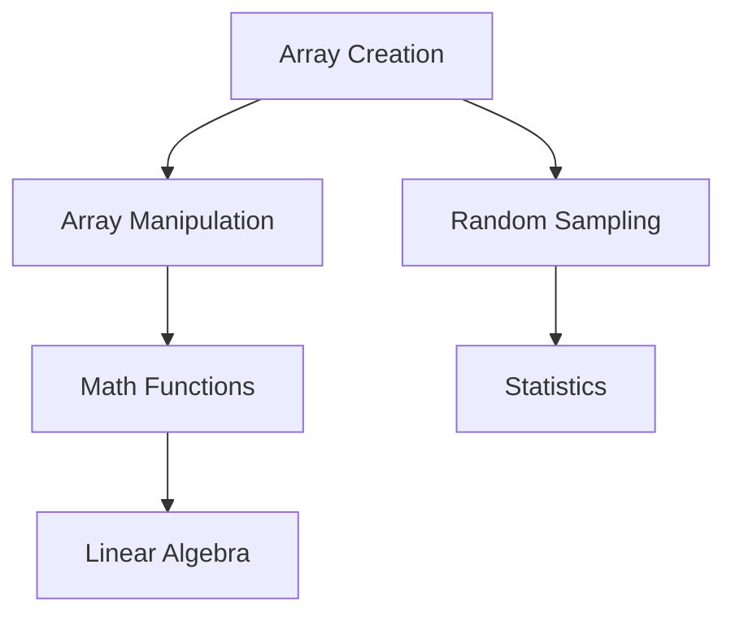

### namespace: numpy

以下是针对NumPy库功能模块的详细分类解释，采用技术文档的结构化表述方式：

---

### **NumPy功能模块详解**

#### 1. **Constants（常量）**
- **作用**：提供科学计算常用常数
- **关键常量**：
  ```python
  np.pi         # 圆周率(3.141592...)
  np.e          # 自然常数(2.718281...)
  np.inf        # 无穷大
  np.nan        # 非数字值
  ```

#### 2. **Array creation routines（数组创建例程）**
- **核心函数**：
  ```python
  np.array([1,2,3])      # 从列表创建
  np.zeros((3,3))        # 全零数组
  np.arange(10)          # 等差序列
  np.linspace(0,1,5)     # 等分区间
  np.random.rand(2,2)    # 随机数组
  ```

#### 3. **Array manipulation routines（数组操作例程）**
- **典型操作**：
  | 函数                    | 功能         |
  | ----------------------- | ------------ |
  | `np.reshape(a,(2,3))`   | 改变数组形状 |
  | `np.concatenate((a,b))` | 数组拼接     |
  | `np.split(a,3)`         | 数组分割     |
  | `np.transpose(a)`       | 转置         |

#### 4. **Bit-wise operations（位运算）**
- **运算符**：
  ```python
  np.bitwise_and(x, y)  # 按位与
  np.left_shift(a, 2)   # 左移2位
  np.invert(x)          # 按位取反
  ```

#### 5. **String functionality（字符串处理）**
- **向量化操作**：
  ```python
  np.char.add(['a'],['b'])      # 输出['ab']
  np.char.upper(['hello'])      # 输出['HELLO']
  ```

#### 6. **Datetime support functions（日期时间支持）**
- **时间差计算**：
  ```python
  date = np.datetime64('2023-01-01')
  delta = np.timedelta64(1, 'D')  # 1天时间差
  ```

#### 7. **Data type routines（数据类型例程）**
- **类型检查与转换**：
  ```python
  np.can_cast(x, np.float32)  # 检查可转换性
  np.result_type(a, b)        # 确定计算结果类型
  ```

#### 8. **Mathematical functions（数学函数）**
- **特殊函数**：
  ```python
  np.sin(x)          # 三角函数
  np.exp(x)          # 指数函数
  np.power(a, b)     # 幂运算
  ```

#### 9. **Linear algebra（线性代数）**
- **矩阵运算**：
  ```python
  np.linalg.inv(A)   # 矩阵求逆
  np.dot(A, B)       # 矩阵乘法
  np.eig(A)          # 特征值分解
  ```

#### 10. **Random sampling（随机抽样）**
- **概率分布**：
  ```python
  np.random.normal(0,1,100)  # 标准正态分布
  np.random.randint(0,10)    # 均匀整数分布
  ```

#### 11. **Statistics（统计函数）**
- **常用统计量**：
  ```python
  np.mean(a)        # 平均值
  np.percentile(a, 90)  # 90分位数
  np.corrcoef(x,y)  # 相关系数
  ```

#### 12. **Discrete Fourier Transform（离散傅里叶变换）**
- **频谱分析**：
  ```python
  np.fft.fft(signal)  # 快速傅里叶变换
  np.fft.fftfreq(n)   # 频率采样点
  ```

#### 13. **Polynomials（多项式）**
- **多项式拟合**：
  ```python
  p = np.poly1d([1,2,3])  # 创建多项式x²+2x+3
  p.deriv()               # 求导得2x+2
  ```

#### 14. **Window functions（窗函数）**
- **信号处理应用**：
  
  ```python
  np.hanning(100)    # 汉宁窗
  np.blackman(50)    # 布莱克曼窗
  ```

---

### **模块交互关系**


